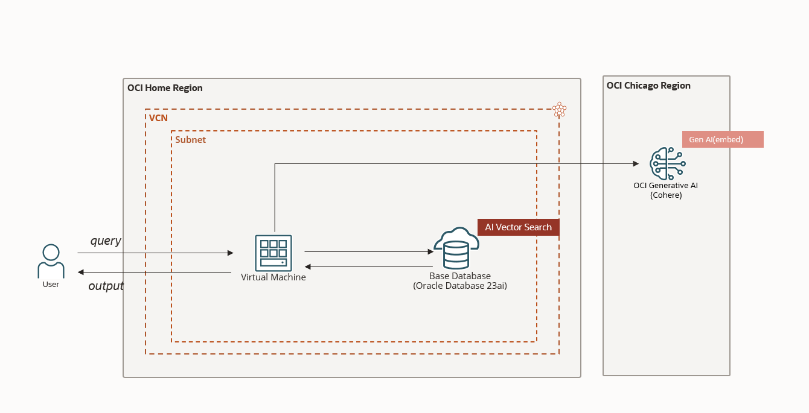

# embed_insert_data_100k
## 概要
このコードkitは大規模データをOCI Generative AIを使い別の仮想マシン上でベクトル化して、そのベクトルデータをOracle Database 23aiに保存するコードです。

## アーキテクチャ
OCI上で以下のようなアーキテクチャを作成します。


## 前提
* Oracle Cloud Infrastructureの環境
  * ネットワークリソースの構築
  * Virtual Machineの構築
  * Oracle Base Database 23aiの構築
  * Chicago or Frankfurt Regionのサブスクライブ
* Virtual Machineの環境構築
  * Python環境
  * oci-sdkが利用できる環境

## 手順
0. [事前準備](#0-事前準備)
1. [Source Table作成](#1-source-table作成)
2. [Source データのInsert](#2-source-データのinsert)
3. [Target Tableの作成](#3-target-tableの作成)
4. [OCI Generative AIを使ってEmbedしたデータの保存](#4-oci-generative-aiを使ってembedしたデータの保存)
5. [Vector Search](#5-vector-search)
6. [Table削除](#6-table削除)


## 0. 事前準備
### GitリポジトリのClone
ご自身の環境にGitリポジトリをCloneします。
```bash
$ git clone https://github.com/sh-sho/embed_insert_100k_data_kit.git
```

以下のようなリポジトリ構成になっています。
```bash
$ cd embed_insert_100k_data_kit/src/
$ tree -a
.
├── .env.example
├── 01.create_source_table.py
├── 02.insert_data.py
├── 03.create_target_vector_table.py
├── 04.embed_insert_texts.py
├── 05.execute_vector_search.py
├── 06.drop_table.py
├── requirements.txt
├── table_detail.py
└── utils.py
```

### Python環境
Virtual MachineにPythonをインストールし実行環境を作成してください。
```bash
$ python --version
Python 3.11.0rc1
```
`requirements.txt`に必要なPythonライブラリが記載されているので以下のコマンドでインストールをします。
```bash
$ pip install -r requirements.txt
```
Vector Searchを行うため`python-oracledb`のバージョンは2.2.1以上のものを使用してください。

### 環境変数の設定
環境変数を設定します。
`.env.example`ファイルをコピーして`.env`ファイルを作成します。
```bash
$ cp .env.example .env
```
`.env`の内容をご自身の環境に合わせて書き換えます。
```
UN=username
PW=password
DSN=dsn
OCI_CONFIG_FILE=~/.oci/config
OCI_COMPARTMENT_ID=ocid1.compartment.oc1..aaaaaaaaxxxxxxxxxxxxxxxxxxxxxxxxxxxxxx
CSV_DIRECTORY_PATH=/tmp_data
CONFIG_PROFILE=CHICAGO
```
`CONFIG_PROFILE`はOCI Generative AIをCallする際に使用するのでChicago (or Frankfurt) RegionのProfile名を指定してください。

## 1. Source Table作成
`01.create_source_table.py`のコードを実行すると、`SOURCE_TABLE`が以下の構成で作成されます。

| Column名 | Data Type | Size |
| ----| -----| ---- |
| PRODUCT_NAME | VARCHAR2 | 100 BYTE |
| PRODUCT_CODE | VARCHAR2 | 100 BYTE |
| PRODUCT_SEARCH | VARCHAR2 | 100 BYTE |

`01.create_source_table.py`のコードを実行すると、以下のような出力がされます。
```
$ python 01.create_source_table.py
Start Creating Table
End Creating Table
```

## 2. Source データのInsert
`02.insert_data.py`のコードを実行すると、SourceとなるサンプルデータをTableにInsertされます。
以下のようなサンプルデータを10万行Insertします。
```
Product 1, Product Code 1 , Search Keyword 1
Product 2, Product Code 2 , Search Keyword 2
...
Product 100000, Product Code 100000 , Search Keyword 100000
```

`02.insert_data.py`を実行すると以下の内容が出力されます。
```bash
$ python 02.insert_data.py 
Start Insert Data
End Insert Data
```

## 3. Target Tableの作成
`03.create_target_vector_table.py`のコードを実行すると、以下のようなTarget Tableが作成されます。

| Column名 | Data Type | Size |
| ----| -----| ---- |
| NAME | VARCHAR2 | 100 BYTE |
| CODE | VARCHAR2 | 100 BYTE |
| SOURCE_COLUMN | VARCHAR2 | 100 BYTE |
| VECTOR_COLUMN | VECTOR | |


`03.create_target_vector_table.py`を実行すると以下の内容が出力されます。
```bash
$ python 03.create_target_vector_table.py 
Create VECTOR type Table.
```

## 4. OCI Generative AIを使ってEmbedしたデータの保存
`04.embed_insert_texts.py`のコードを実行すると、Source TableのデータをEmbedしてTarget Tableに保存します。

`04.embed_insert_texts.py`のコードを実行すると以下の内容が出力されます。
```bash
$ python 04.embed_save_texts.py
Auth Success
Status:200
...
.0295257568359375, -0.045745849609375, -0.0303802490234375, -0.0028781890869140625, -0.006397247314453125, 0.0224609375, 0.067626953125, -0.04595947265625]))]
Data vectorization process is complete.
Total Run Time  199.31680464744568
success delete csv directory
```

## 5. Vector Search
`05.execute_vector_search.py`のコードの実行時に、検索する文字列を入力してください。入力した文字列をEmbedしベクトル検索が行われます。

`05.execute_vector_search.py`のコードを実行すると以下の内容が出力されます。
```bash
$ python 05.execute_vector_search.py '23'
Search Text：23
Start Vector Search
============Results============
1: ('Product 23', 'Search Keyword 23', 0.19899375827306565)
2: ('Product 233', 'Search Keyword 233', 0.24061140639163003)
3: ('Product 231', 'Search Keyword 231', 0.25913973326091844)
End Vector Search
```

## 6. Table削除
`06.drop_table.py`のコードを実行すると、Source TableとTarget Tableが削除されます。

`06.drop_table.py`のコードを実行すると以下の内容が出力されます。
```bash
$ python 06.drop_table.py 
Start Drop Table
Drop Table SOURCE_TABLE
Drop Table TARGET_TABLE
End Drop Table
```


